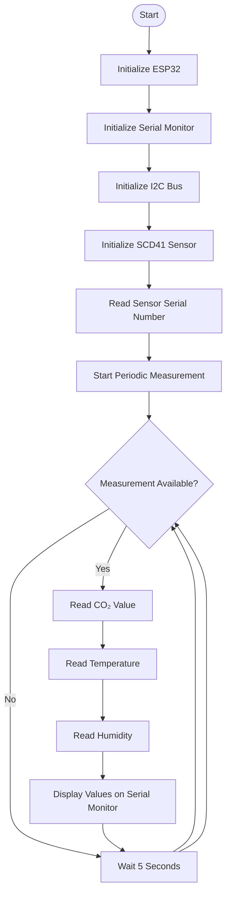

```mermaid
flowchart TD

A([Start])
B[Initialize ESP32]
C[Initialize Serial Monitor]
D[Initialize I2C Bus]
E[Initialize SCD41 Sensor]
F[Read Sensor Serial Number]
G[Start Periodic Measurement]

H{Measurement Available?}

I[Read CO₂ Value]
J[Read Temperature]
K[Read Humidity]

L[Display Values on Serial Monitor]

M[Wait 5 Seconds]


A --> B
B --> C
C --> D
D --> E
E --> F
F --> G
G --> H

H -- No --> M
M --> H

H -- Yes --> I
I --> J
J --> K
K --> L
L --> M

M --> H
```