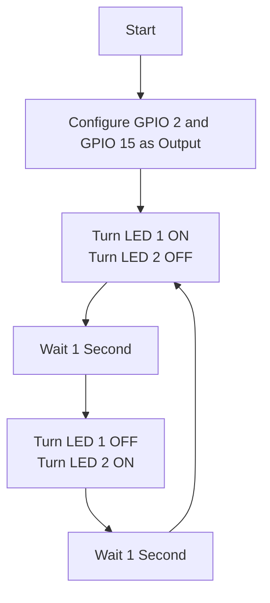

```mermaid
flowchart TD

    A[Start]
    B[Configure GPIO 2 and GPIO 15 as Output]

    C[Turn LED 1 ON<br>Turn LED 2 OFF]
    D[Wait 1 Second]

    E[Turn LED 1 OFF<br>Turn LED 2 ON]
    F[Wait 1 Second]

    A --> B
    B --> C
    C --> D
    D --> E
    E --> F
    F --> C
```