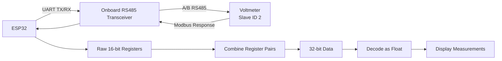
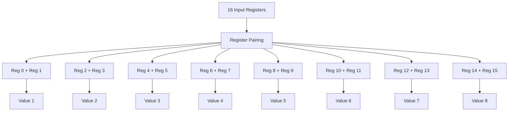

# ESP32 Modbus RTU Voltmeter – Program Flowchart

```mermaid
flowchart TD

    A([ESP32 Start]) --> B[Create Modbus Data Structure]

    B --> C[Initialize Modbus Communication]

    C --> C1[Configure UART2]
    C1 --> C2[Set Baud Rate: 9600]
    C2 --> C3[Set Format: 8N1]
    C3 --> C4[Set TX GPIO17 and RX GPIO16]
    C4 --> D[Start Main Monitoring Loop]

    D --> E[Create Modbus RTU Request]

    E --> E1[Set Slave ID = 2]
    E1 --> E2[Set Function Code = 04]
    E2 --> E3[Set Start Address = 0]
    E3 --> E4[Request 16 Input Registers]
    E4 --> E5[Calculate and Add CRC16]

    E5 --> F[Send Request Through UART]

    F --> G[Onboard RS485 Transceiver]

    G --> H[Transmit Request Through A/B Lines]

    H --> I[Voltmeter Receives Modbus Request]

    I --> J[Voltmeter Sends Modbus Response]

    J --> K[ESP32 Receives Response]

    K --> L{Valid Response Length?}

    L -- No --> X[Report Modbus Read Failure]
    L -- Yes --> M{Correct Slave ID?}

    M -- No --> X
    M -- Yes --> N{Correct Function Code?}

    N -- No --> X
    N -- Yes --> O{Correct Byte Count?}

    O -- No --> X
    O -- Yes --> P{CRC Valid?}

    P -- No --> X
    P -- Yes --> Q[Extract 16-bit Registers]

    Q --> R[Store Registers 0 to 15]

    R --> S[Decode Register Pairs]

    S --> S1[Registers 0 + 1 → Value 1]
    S1 --> S2[Registers 2 + 3 → Value 2]
    S2 --> S3[Registers 4 + 5 → Value 3]
    S3 --> S4[Continue for Remaining Pairs]

    S4 --> T[Combine Two 16-bit Words]

    T --> U[Create 32-bit Bit Pattern]

    U --> V[Interpret 32-bit Pattern as IEEE-754 Float]

    V --> W[Print Raw Registers and Decoded Values]

    W --> Y[Wait 1 Second]

    X --> Y

    Y --> D
```



## Simplified Working Flow



## Register Decoding Flow



## Data Conversion

Each measurement is currently interpreted using two consecutive 16-bit registers:

```text
Register N        Register N+1
  16 bits            16 bits
     │                   │
     └────────┬──────────┘
              ↓
         Combine Words
              ↓
          32-bit Data
              ↓
       IEEE-754 Float
              ↓
        Decoded Value
```

The current implementation assumes the first register is the low word and the second register is the high word. This will be verified during hardware testing.