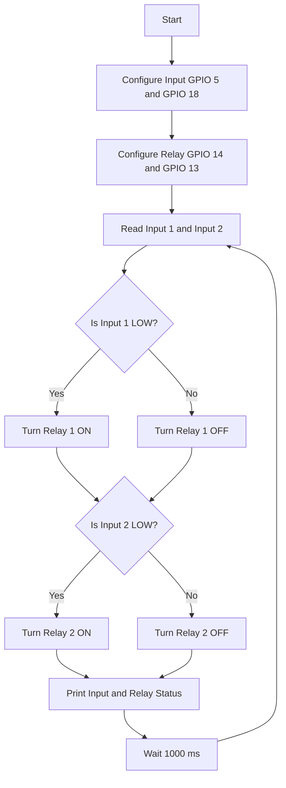

```mermaid
flowchart TD

    A[Start]
    B[Configure Input GPIO 5 and GPIO 18]
    C[Configure Relay GPIO 14 and GPIO 13]
    D[Read Input 1 and Input 2]

    E{Is Input 1 LOW?}
    F[Turn Relay 1 ON]
    G[Turn Relay 1 OFF]

    H{Is Input 2 LOW?}
    I[Turn Relay 2 ON]
    J[Turn Relay 2 OFF]

    K[Print Input and Relay Status]
    L[Wait 1000 ms]

    A --> B
    B --> C
    C --> D

    D --> E

    E -->|Yes| F
    E -->|No| G

    F --> H
    G --> H

    H -->|Yes| I
    H -->|No| J

    I --> K
    J --> K

    K --> L
    L --> D
```