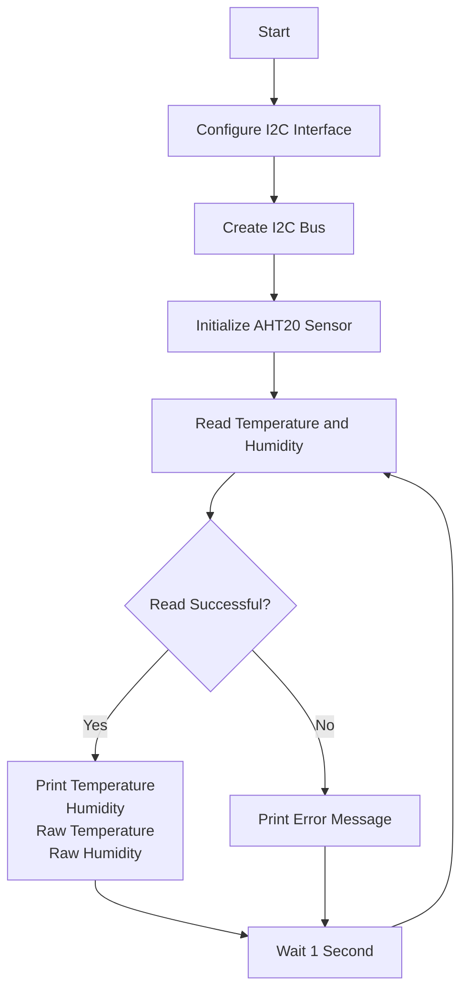

```mermaid
flowchart TD

    A[Start]
    B[Configure I2C Interface]
    C[Create I2C Bus]
    D[Initialize AHT20 Sensor]
    E[Read Temperature and Humidity]

    F{Read Successful?}

    G[Print Temperature<br>Humidity<br>Raw Temperature<br>Raw Humidity]
    H[Print Error Message]

    I[Wait 1 Second]

    A --> B
    B --> C
    C --> D
    D --> E

    E --> F

    F -->|Yes| G
    F -->|No| H

    G --> I
    H --> I

    I --> E
```