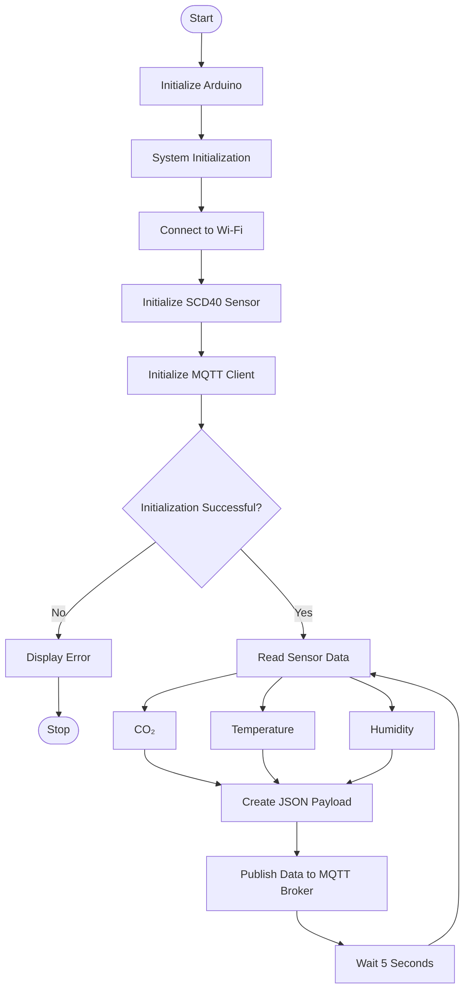

```mermaid
flowchart TD

A([Start]) --> B[Initialize Arduino]
B --> C[System Initialization]

C --> D[Connect to Wi-Fi]
D --> E[Initialize SCD40 Sensor]
E --> F[Initialize MQTT Client]

F --> G{Initialization Successful?}

G -- No --> H[Display Error]
H --> I([Stop])

G -- Yes --> J[Read Sensor Data]

J --> K[CO₂]
J --> L[Temperature]
J --> M[Humidity]

K --> N[Create JSON Payload]
L --> N
M --> N

N --> O[Publish Data to MQTT Broker]

O --> P[Wait 5 Seconds]

P --> J
```